# IoT-Blockchain Manual 

> Repositorio GitHub del proyecto [BCIOT](https://github.com/rafael1599/BCIOT).

**Contenido:** [ Introducción](#introduccion) -[ Características](#caracteristicas) -[ Descripciones](#descripciones)
>falta corregir el contenido **NO OLVIDAR**
  

## Introducción

Un pequeño preámbulo que será agregado más adelante explicando de manera general nuestro proyecto.

---

## Caracteristicas
¿Qué es lo que hace? aún en desarrollo..


---

## Contenido


### **Algunos conceptos clave**
Antes de comenzar con la programación nos gustaría presentar algunos conceptos necesarios para poder comprender el funcioniamento de lo que estamos desarrollando en este proyecto.

### ¿Qué es Blockchain?
> Blockchain es un libro mayor compartido e inmutable que facilita el proceso de registro de transacciones y de seguimiento de activos en una red de negocios. Un activo puede ser tangible (una casa, un auto, dinero en efectivo, terrenos) o intangible (propiedad intelectual, patentes, derechos de autor, marcas). Prácticamente cualquier cosa de valor puede ser rastreada y comercializada en una red de blockchain, reduciendo el riesgo y los costos para todos los involucrados.

### ¿Qué es Ethereum?
>Ethereum es una plataforma digital que adopta la tecnología de cadena de bloques (blockchain) y expande su uso a una gran variedad de aplicaciones. Ether, su criptomoneda nativa, es la segunda más grande del mercado.

### ¿Qué es un Smart Contract o contrato inteligente?
>Un smart contract es un tipo especial de instrucciones que es almacenada en la blockchain. Y que además tiene la capacidad de autoejecutar acciones de acuerdo a una serie de parámetros ya programados. Todo esto de forma inmutable, transparente y completamente segura.

### ¿Qué es Remix?
>Remix es un entorno integrado de desarrollo (IDE) basado en un navegador que integra un compilador y un entorno en tiempo de ejecución para Solidity sin los componentes orientados al servidor.

### ¿Qué es Infura?
>Infura es una plataforma para conectar con redes Blockchain y permite a los desarrolladores construir Smart Contracts utilizando un API JSON-RPC para interactuar con múltiples blockchains.

### ¿Qué es una red de pruebas?
>Una red testnet es una herramienta imprescindible en el desarrollo de criptomonedas como Bitcoin. Gracias a este tipo de redes los equipos de desarrollo pueden hacer pruebas sin afectar el funcionamiento de la red original.

### ¿Qué es RINKEBY?
>Rinkeby. Una red de prueba con prueba de autoridad para los que ejecutan clientes de Geth.

### ¿Qué es IoT?
>El término IoT, o Internet de las cosas, se refiere a la red colectiva de dispositivos conectados y a la tecnología que facilita la comunicación entre los dispositivos y la nube, así como entre los propios dispositivos

### ¿Qué vulnerabilidades tiene el IoT?
>El Internet de las cosas o IoT por sus siglas en inglés, tiene un reto muy grande que hacer frente y este es el de la seguridad, pues los dispositivos que maneja, se encuentran vulnerables. Además hoy en día existe un crecimiento de adopción de estos mismos que es cada vez mayor, por tanto, el riesgo de recibir ataques a través de ellos es cada vez mayor también. Así mismo, mientras las empresas que desarrollan la tecnología IoT buscan nuevas formas de proteger la infraestructura donde se guardan y manejan los datos, del mismo modo, los atacantes también idean nuevas formas vulnerar la seguridad, acceder a información confidencial, hacerse con el control de acceso a los dispositivos o sensores y así al final, de una u otra manera, afectando la integridad de la información que estos envían o reciben, y hasta la disponibilidad de los mismos para su dueño.

### ¿Cómo la tecnología blockchain puede ayudar en esto?
>La tecnología Blockchain ayudará dando un manejo seguro de la información, permitirá a los usuarios hacer uso de cualquier dispositivo IoT tal como antes lo hacían, pero con una capa total de seguridad. Haciendo uso de tecnologías de encriptación de los datos, de esta manera asegurando la privacidad de la información que el usuario envía a la red sin la posibilidad de que alguien intercepte esta información y pueda alterarla, robarla, eliminarla o usarla de manera indebida, lo que beneficiará a todos los usuarios que tienen accesos a los dispositivos IoT que hagan uso de esta tecnología integrada en cualquier parte del mundo.

### ¿Qué es una Arduino y para qué sirve?
> Arduino es una placa que tiene todos los elementos necesarios para conectar periféricos a las entradas y salidas de un microcontrolador. Es decir, es una placa impresa con los componentes necesarios para que funcione el microcontrolador y su comunicación con un ordenador a través de la comunicación serial.

---

# Instalación de herramientas de desarrollo
A continuación explicamos el paso a paso del desarrollo completo de esta pequeña demostración.

## 1. Instalando Python‎ ‎ ‎ ‎ ‎ ‎
> Necesitamos descargar python (en su última versión estable), buscamos "python Download" en nuestro navegador o directamente puedes ingresar a la página oficial de Python https://www.python.org/downloads/.
> Damos click en el primer 
[resultado](https://www.python.org/downloads/) que encontramos.

<p style ="text-align: center" >
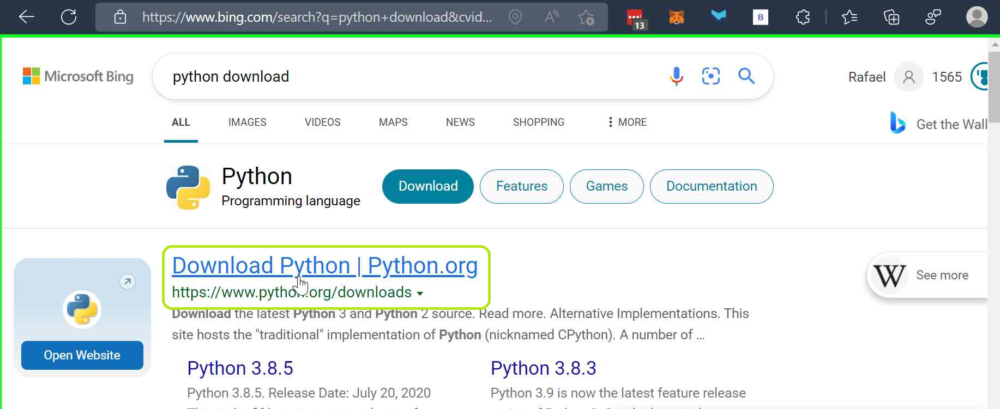
</p>


> Una vez dentro de la página de descarga, generalmente ya tenemos lista la versión de sistema operativo que necesitamos, pero podemos verificar dando click en el nombre del sistema operativo que estamos usando.


<p style ="text-align: center" ></p>

> En mi caso lo voy a descargar para SO Windows y se vería así.

<p style ="text-align: center" ></p>

> En este caso sería la versión seria la version 3.10.7

Damos click en el botón de descarga.

<p style ="text-align: center" ></p>

> Guardamos el archivo de instalación.

<p style ="text-align: center" ></p>

> Guardamos en nuestro escritorio.

<p style ="text-align: center" ></p>

> Ejecutamos el archivo de instalación como administrador.

<p style ="text-align: center" ></p>

> Luego simplemente damos click al botón que dice Si, y se abrirá esta ventana de instalación de Python, donde **primero** nos aseguramos de tener marcada la casilla donde señalo la **X** roja y luego damos click en "Customize Installation".

<p style ="text-align: center" ></p>

> En la siguiente vista lo dejamos tal cual como esta y damos click en "Next".

<p style ="text-align: center" ></p>

> Luego nos aseguramos que queden las opciones marcadas como en esta imagen así como también el lugar de instalación.

<p style ="text-align: center" ></p>

> Y por último vamos a dar click en "Install".

<p style ="text-align: center" ></p>

> Al final simplemente seleccionas el botón que dice "close" y listo terminamos de instalar Python!.

<p style ="text-align: center" ></p>

---

## ‎  
## 2. Instalando Visual Studio Code‎ ‎ ‎ ‎ ‎ ‎
> Necesitamos descargar python (en su última versión estable), buscamos "python Download" en nuestro navegador o directamente puedes ingresar a la página oficial de Python ['https://code.visualstudio.com/'].

> Damos click en el primer 
[resultado](https://code.visualstudio.com/) que encontramos.
<p style ="text-align: center" ></p>

> Dentro de la pagina, veremos la opcion de Download for Windows, seleccionamos la flecha del costado

<p style ="text-align: center" ></p>

> Dspues de seleccionar, le saldra las opciones de descaragr segun el sistema operativo que tien, en este caso se selecciona para Windows
<p style ="text-align: center" ></p>

> Despues de seleccionado la descarga para windows saldra la descarga, este caso sale en la parte inferior.

<p style ="text-align: center" ></p>

> despues abrimos la descarga y le aparecera la siguiente ventana, en esta parte seleccionamos aceptamos el acuerdo

<p style ="text-align: center" ></p>

>Despues de acepta el acuerdo seleccionas siguiente y te saldra la opción de Seleccionar la carpeta de destino, selecionamos el destino de la carpetay le damos siguiente 

<p style ="text-align: center" ></p>

> En esta parte le damos Siguiente 

<p style ="text-align: center" ></p>

> En esta parte le damos Siguiente 
<p style ="text-align: center" ></p>

> En esta parte le Instalar
<p style ="text-align: center" ></p>

> Esperemos a que termine de instalar
<p style ="text-align: center" ></p>

> Terminado la descarga ponemos finalizar.
<p style ="text-align: center" ></p>

> Ahora si el Visual Studio Code esta listo para poder utlizarlo.
<p style ="text-align: center" ></p>

---

## ‎ 

## 3. Creando red de prueba en‎ ‎ ‎ ‎

> Buscamos infura en nuestro navegador e ingresamos al primer resultado de la busqueda.

<p style ="text-align: center" ></p>

>Damos click en unete.

<p style ="text-align: center" ></p>

> Nos creamos una cuenta gratuita.

<p style ="text-align: center" ></p>

> Ingresamos a nuestro correo y confirmamos la creación de la cuenta.

<p style ="text-align: center" ></p>

>Completamos la iformación que nos pide y presionamos el último botón.

<p style ="text-align: center" ></p>

>Procedemos a crear nuestra primera red de prueba donde primero elegimos "Ethereum Beacon Chain" y despues colocamos un nombre a nuestro proyecto.

<p style ="text-align: center" ></p>

>Luego nos muestra algunas opciones y algo de información.

<p style ="text-align: center" ></p>

> **Listo, ya habremos creado nuestra red de pruebas en Infura, mas adelante mostramos como usarla.**
---

## ‎ 

## 4. Creando el Smart Contract en Remix IDE ‎ ‎ ‎ ‎ ‎ ‎
El contrato inteligente fue desarrollado en Remix con el lenguaje de programación Solidity
### Pasos para crear el Smart Contract
> Para poder desarrollar el Smart Contract primero debes abrir Remix.

Primero se deb poner en el busacdor Remix ethereum o Remix ethe, despues seleccionamos la primera opcion como se muestra en la imagen.

<p style ="text-align: center" >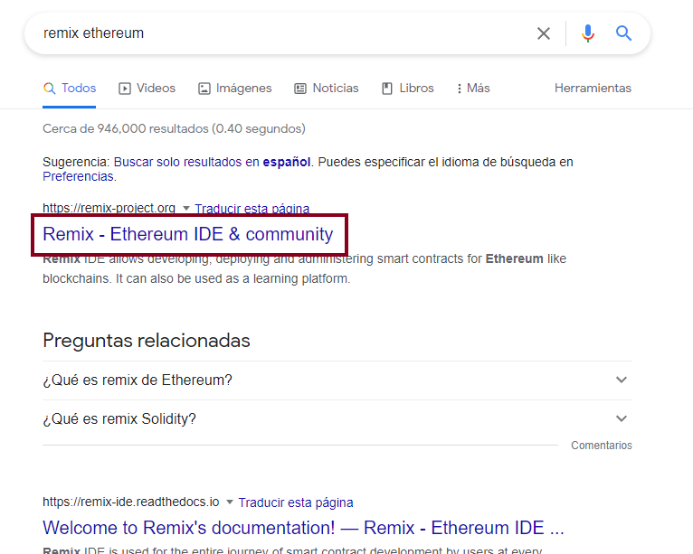</p>

> Al abrir se puede visualizar la siguiente pagina
<p style ="text-align: center" ></p>

> En esta parte seleccionamos la opcion "Remix IDE" que es para entrar a la parte de desarrollo y poder codificar el Smart Contract.
<p style ="text-align: center" >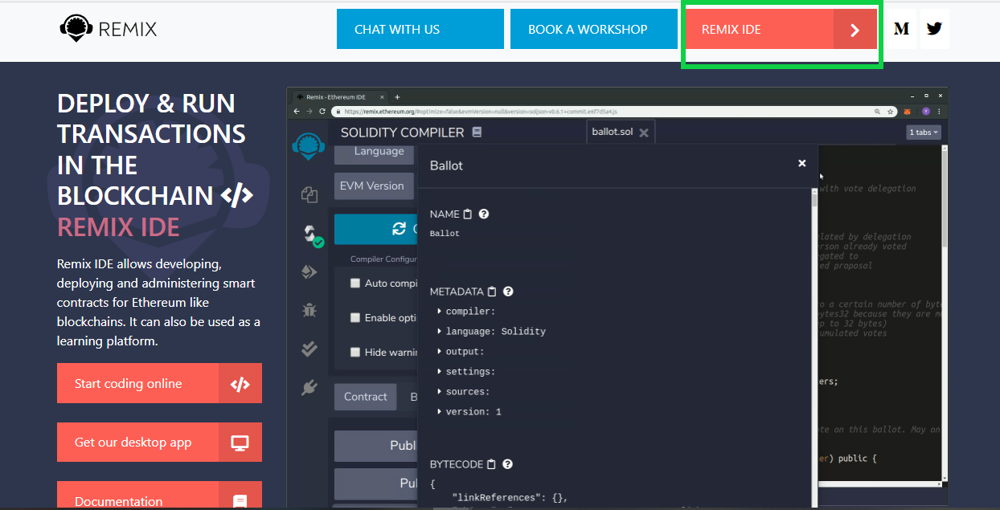</p>

>Aqui se desarrolla el Smart Contract
<p style ="text-align: center" >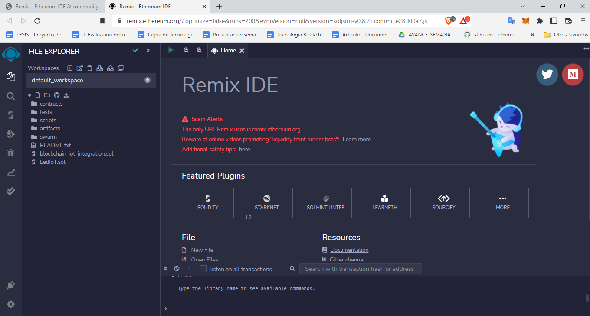</p>

> En esta parte se muetra algunos archivos por default
<p style ="text-align: center" >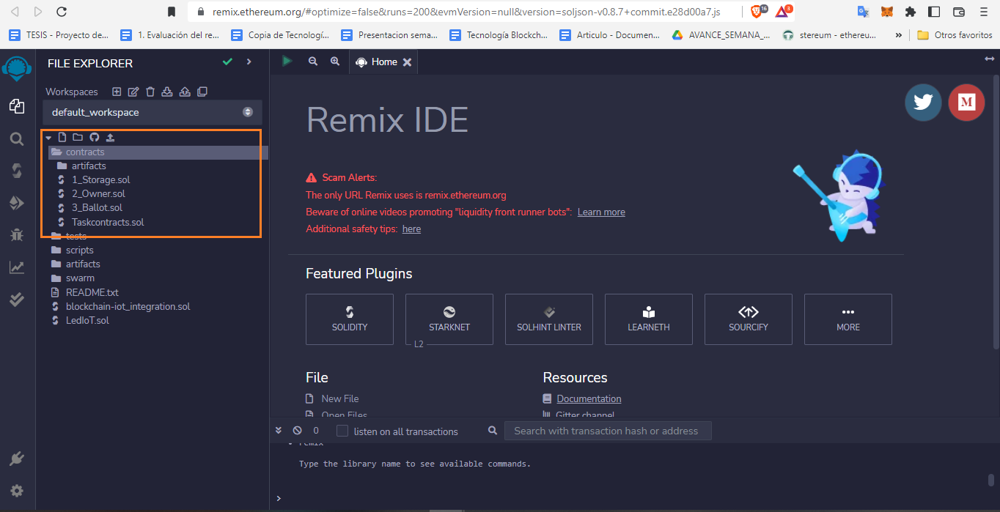</p>

> Para comenzar a desarrollar el Smart Contract Primero se debe crear un nuevo archivo '.sol' asi se crear los archivos Solidity 
<p style ="text-align: center" >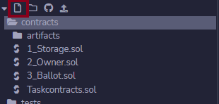</p>

> Como se muestra en la Imagen
<p style ="text-align: center" >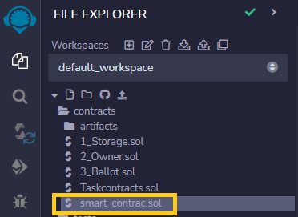</p>

> Parte principal de un Smart Contract es colocar la licencia y la version de Solidity que se va a utilizar.
<p style ="text-align: center" >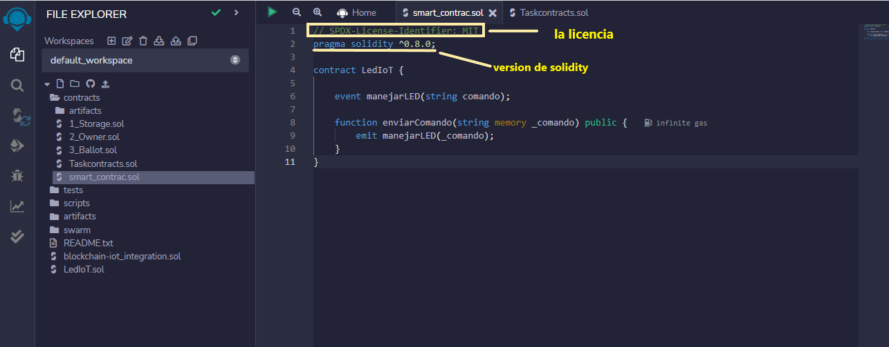</p>
## ‎ 

### Codigo del smart contract
Este es un algoritmo sencillo que simplemente se encarga de enviar un dato a la blockchain donde está desplegado el mismo para que de esa manera, haga llegar ese dato a nuestro sistema desarrollado en python que presentaremos más adelante.

```python
// SPDX-License-Identifier: MIT
pragma solidity ^0.8.0;
 
contract LedIoT {
 
    event manejarLED(string comando);
 
    function enviarComando(string memory _comando) public {
        emit manejarLED(_comando);
    }
}
```

---

## Desarrollo del sistema en VScode

Aquí mostramos los pasos para crear el programa que nos va a permitir conectar Blockchain con IoT mediante el uso de un contrato inteligente desplegado en una testnet llamada RINKEBY a la cual nos conectaremos mediante Infura, una herramienta que permite la interacción entre sistemas web3 y web2.


#### **Desarrollo del programa encargado de conectar arduino con nuestro contrato inteligente alojado en RINKENBY.**

Aquí presentamos las importaciones que vamos a utilizar para que nuestro proyecto pueda funcionar...

```python

import json                  #para poder utilizar codigo json dentro de este programa
from web3 import Web3 as w3  #Para todo lo relacionado a blockchain
import asyncio               #Para ejecutar bucles asincronos
import warnings              #Para omitir mensajes warning
import time                  #Para obtener hora y fecha de el sistema
import pyfirmata             #nos permite manejar arduino
from pyfirmata import Arduino, util

```
En esta parte, se ve el código para que la aplicación se pueda conectar a Infura.

```python
infura_url =  '...'              #dentro de las comillas se coloca el enlace que Infura te proporciona una vez creada tu red de testeo dentro de su pagina
w3= w3(w3.HTTPProvider(infura_url)) #
print(w3.isConnected())          #
print("...")                     #
```
Aquí se muestra el código para que la aplicación se pueda conectar al Smart Contract (contrato inteligente)

```python
contract_Address = '...'         #
contract_abi = json.loads('....')#
 
contract = w3.eth.contract(      #
    address=contract_Address,    #
    abi=contract_abi)            #
```

### Código para conectar al Arduino 
```python
board = Arduino("COM7")                      #

def handle_event(event):                     #
    person_dict = json.loads(w3.toJSON(event))  #
    comando = person_dict["args"]            #
    print(comando["comando"])                #
    if comando["comando"] == "1":            #
        board.digital[13].write(1)           #
        print("LED encendido")               #
    elif comando["comando"] == "0":          #
        board.digital[13].write(0)           #
        print("LED apagado")                 #
    elif comando["comando"] == "2":          #
        sys.exit("Bye bye!")                 #
    else:
        print("la opción que elegiste"       #
        +"no es correcta o reconocida. 
        +"Intentalo de nuevo")
```
```python
async def log_loop(event_filter,             #
poll_interval):                              #
    while True:                              #
        for manejarLED in                    #
        event_filter.get_new_entries():      #
            handle_event(manejarLED)         #
        await asyncio.sleep(poll_interval)   #
```
```python
def main():
    event_filter = contract.events.manejarLED.createFilter( #
        fromBlock='latest')                              #
    loop = asyncio.get_event_loop()                      #
    try:
        loop.run_until_complete(asyncio.gather(          #
            log_loop(event_filter, 2)))                  #
    finally:
        # close loop to free up system resources
        print("Error inesperado. Cerrando programa para no dañar el equipo")
        loop.close()                                    #
 
if __name__ == "__main__":
    main()
```
```python
```
```python
```
```python
```
 ['Volver al inicio'](#Contenido)
 
## Descripciones

['Volver al inicio'](#Contenido)

# Blockchain Privada 
Para la creacion de una blockchain privada es necesario descargar un programa que simulana ser un nodo de la misma red de Ethereumeste programa es GO ethereum o Geth abrebiado https://geth.ethereum.org/

<p style ="text-align: center" ></p>

## Pasos para poder desarrollar la Blockchain Privada

Primero de debe descaragr el instalador de geth
<p style ="text-align: center" >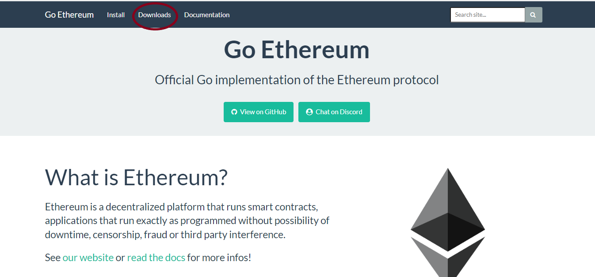</p>
<p style ="text-align: center" >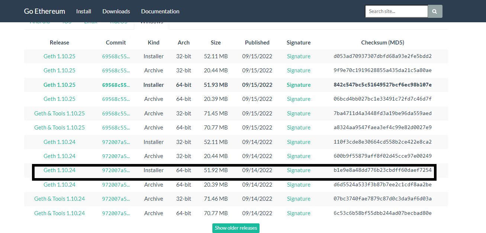</p>
Despues de descargo Geth vamos a realizar por comando la manipulacion de la blockchain privada, para eso vamos a utilizar PowerShell o Cmd 

<p style ="text-align: center" ></p>
Primero crearemos una carpeta donde se creara el bloque 0 o genesis, para realizar la creacion de la carpeta por medio de PowerShell o Cmd encribimos mkdir "El nombre que deseas ponerle a la Bc Privada "
<p style ="text-align: center" ></p>
Seguido entramos dentro de la carpeta creada para eso utilizaremos cd " y el nombre de la carpeta
<p style ="text-align: center" ></p>

<p style ="text-align: center" ></p>
Realizado eso por comando, nosotros dentro de la carpetacreada creamos un archico con lo escrito a continuación

Esta es la codificacion del bloque genesis

Dentro del comando para saber que el tu Bc privada funciona lanzamos el sigueinte comando: geth --datadir "./ "init genesis.json 

<p style ="text-align: center" ></p>

Esto es lo que te tiene uqe salir a la hora de correr el comando si sale de esta manera es que la creacion del bloque genesis se creo correctamente.
<p style ="text-align: center" ></p>
Para poder comenzar a interactuar con el contrato inteligente dentro de la pequeña Bc privada hacemos los siguientes pasos:

Primero ejecutamos la el sigueite comando:   ``` geth --dev --http --http.api 'eth,web3,personal,net' --allow-insecure-unlock --http.corsdomain "*" ```
<p style ="text-align: center" ></p>
> donde ``` geth ```es el comando para poder interactuar con el nodo

> ```http``` es el comando para que poder interactuar con el contrato digital

> ```  allow-insecure-unlock ``` este comando te ayudara a desbloquear las cuenta de los demas nodos que podamos crear dentro de la blockchain

> ``` http.corsdomain " * "``` este comando hace que la conexion por medio Rcp se haga posible para que se pueda conectar con la blockchain creada

<p style ="text-align: center" ></p>
Este es el resultado que debe salir a la hora de correr este comando 

---------------------------------------------------------------------------

Seguido a este procedimiento  abrimos otro terminal o PowerShell donde colocaremos el siguiente comando : geth attac http://localhost o 127.0.0.1:8545 
<p style ="text-align: center" ></p>

> ``` 8545 ``` es el puerto por donde se ejecuta el nodo 

Al lazar este comadno se ejecutara en modo comando como se muestra en la siguiente imagen 

<p style ="text-align: center" ></p>

Dentro de esta consola podras crear cuentas, se podra observar cuantas cuentas creadas, el numero de bloques creados, la información de cada bloque, se pueden hacer hasta transferencia, y se puede ver la información de la transferencia.

En este terminal realizaremos lo sieguiente 

> colocamos este comando ```eth.accounts ``` este mostrara las cuentas que dentro de la blockchain  
<p style ="text-align: center" ></p>
 La cuenta que aparece ahi es la cuenta base o el nodo base que se crea y que tiene ether de preba para poder realizar las transacciones


> despues de eso colocaremos este siguiente comano ``` personal.newAccount ()```, con este comando se acreara nuevas cuentas 
<p style ="text-align: center" ></p>
a la hora de colocar este comando te dira que pongas la contraseña y despues la pongas de nueva para vereficicar. 

Despues de realizado eso ponemos en comando anterior para poder vizualizar la cuenta creada.

Para que la cuenta pueda tener ether hacemos una transferencia de la cuenta base a la nueva cuenta creada, para realizar eso ejecutamos el siguiente comando:
``` eth.sendTransaction({from: eth.coinbase, to: eth.accounts[1], value: web3.toWei(50, "ether")}) ```
<p style ="text-align: center" ></p>
Donde:
> ``` eth.sendTransaction ``` es el comando para realizar la transacción


>```from: eth.coinbase ``` este es que se llama a la cuenta base 

>```to: eth.accounts[1] ``` y la transacción se realizara a la siguiente cuenta 

>```(50, "ether")}) ``` es la cantidad de ether que se enviara de cuenta a cuenta.


#### **NOTA:** 
Mientras reaizas la ejecucion de los comandos anteriores, en el terminal anterior (que debe estar ejecutandose mientras se realiza la interaccion de la blockchain con el Smart Contract) se iran vizualizando los movimientos que se realizan en la blockchain.
<p style ="text-align: center" >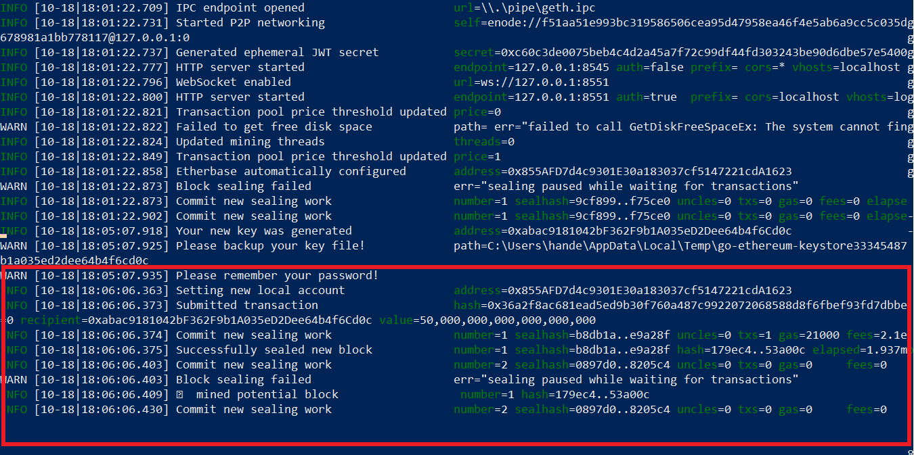</p>
Despues de relaizado todo eso nos vamos a remix, para interactuar con el Remix, se descargo el Remix est este link ['pagina wed'] 

Al abrir remix seleccionamos para ejemplo un Smart Contract que viene por default en remix.
<p style ="text-align: center" ></p>
<p style ="text-align: center" >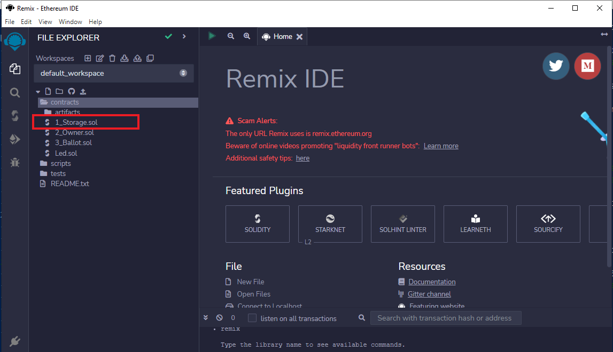</p>

Despues de seleccionado primero se compilara el contrato inteligente <p style ="text-align: center" >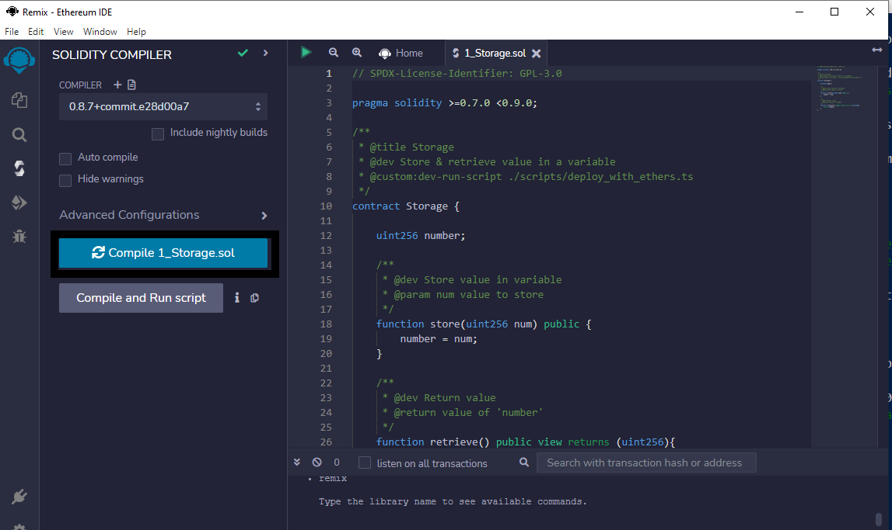</p>

Despues de compilar el contrato inteligente se pasara a saleccionar la opcion de conectar por ``` External Http Provider``` 
<p style ="text-align: center" >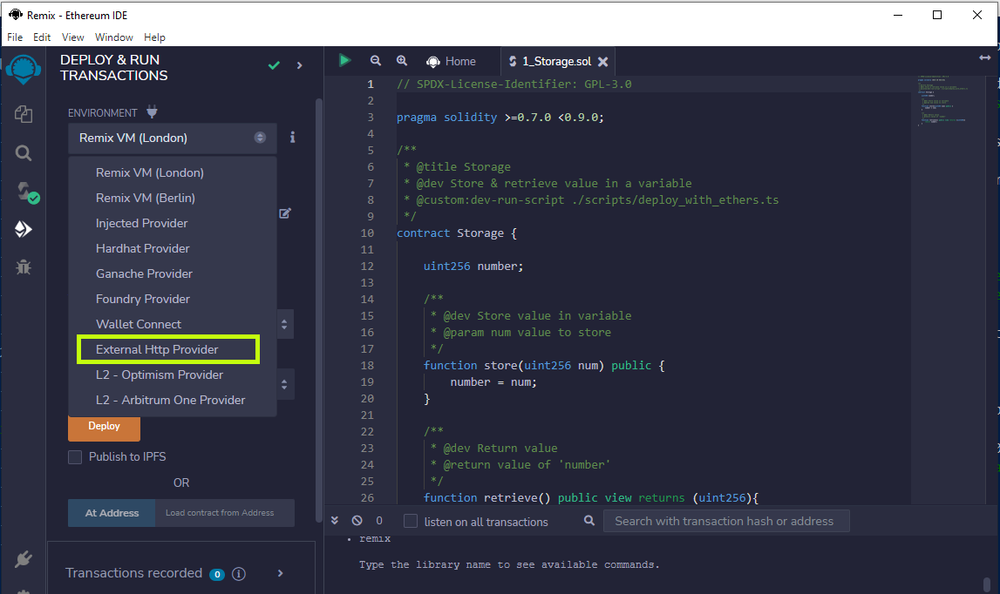</p>

En esta parte se colocara el siguiente enlace que es ``` http://localhost:8545``` o ``` http://127.0.0.1:8545```   y despues ponemos ok

<p style ="text-align: center" ></p>

Despues seleccionamos con la cuenta que quiere que haga la interaccion, te saldra la cuenta base y la creada hace unos moemntos con los ether que ya hemos transaferido, seleccionamos la cuenta creada.
<p style ="text-align: center" >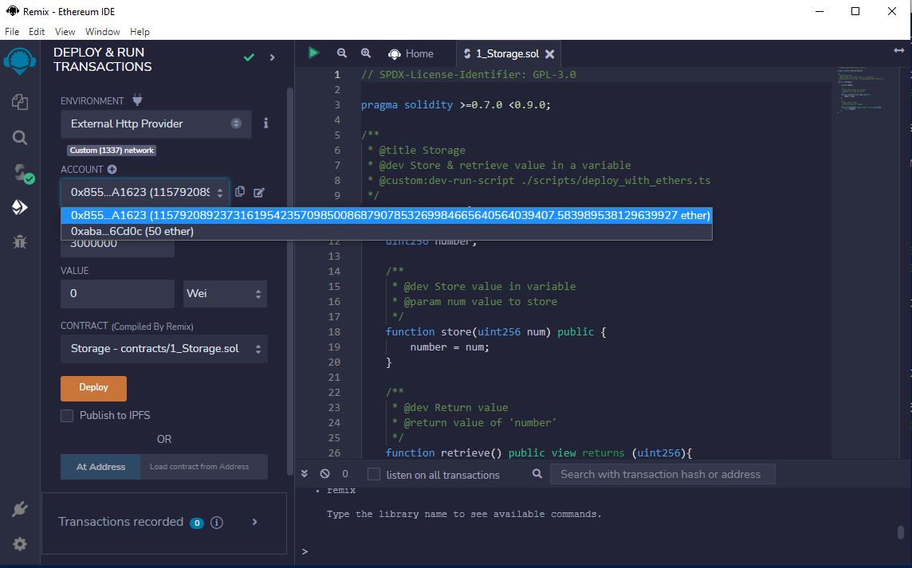</p>
A la hora que le ponemos Deploy que es para desplegar el Smart Contract no se podra ya que la cuenta esta bloqueada, para poder desbloquearla nos vamos al termianl donde se allá ejecutado por comando y colocamos ```personal.unlockAccount("0x..... # el addrees de la ceunta creada") ``` 
<p style ="text-align: center" ></p>
Te pedira la contraseña para poder desbloquearla
<p style ="text-align: center" ></p>
<p style ="text-align: center" ></p>
Despues de realizado eso nos vamos de nuevo al remix y seleccionamos Deploy y el contarto ya esta interactuando con el contarto inteligente 
<p style ="text-align: center" >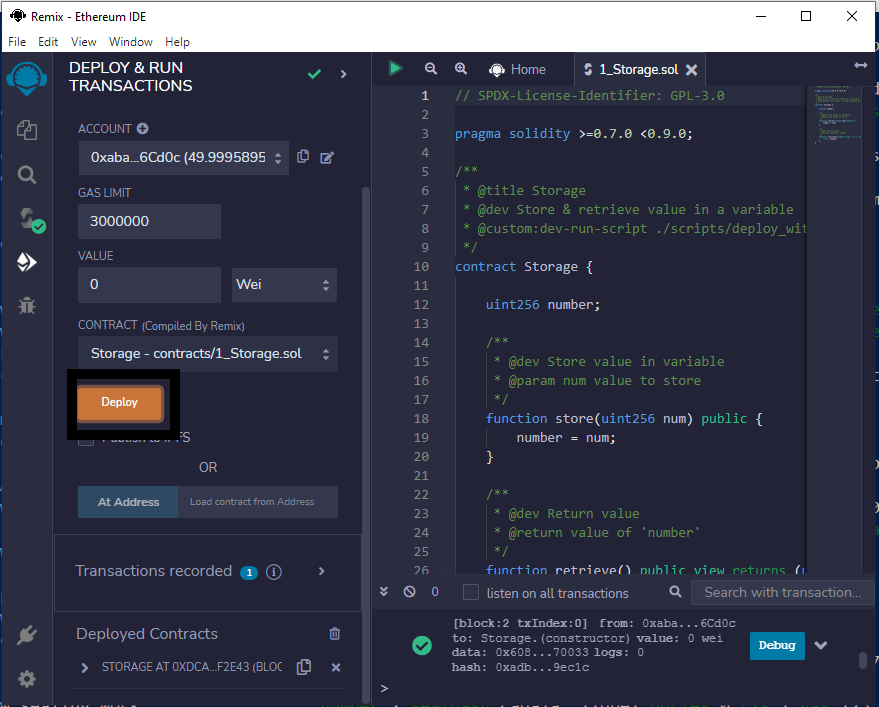</p>

Esto tambien se observada que en la block chain y el contrato esta interactuado en el terminal donde se ve los movimientos de la blockchain.

<p style ="text-align: center" ></p>

